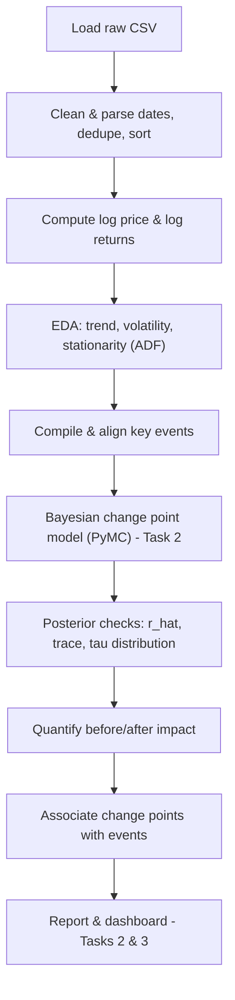

# Task 1 - Planned Analysis Workflow

**Project:** Change Point Analysis and Statistical Modeling of Brent Oil Prices
**Organization:** Birhan Energies (consultancy)
**Author:** Data Science team
**Scope:** This document defines the end-to-end analysis workflow, the role of
change point models, expected outputs, and how the data's statistical properties
inform our modeling choices.

---

## 1. Business Objective

Analyze how major political and economic events affect Brent crude oil prices so
that investors, policymakers, and energy companies can better understand and
react to price changes. Concretely, we aim to:

1. Identify key events that significantly impacted Brent prices over the studied period.
2. Quantify how much these events shifted prices using Bayesian change point analysis.
3. Communicate clear, data-driven insights and their limitations.

---

## 2. Data

- **Source:** `data/raw/BrentOilPrices.csv` - daily Brent price (USD/barrel).
- **Coverage (observed):** 1987-05-20 to 2022-11-14, **9,011** trading days after cleaning.
- **Fields:** `Date`, `Price`.
- **Data caveat:** the file mixes two date formats (`20-May-87` and `Nov 09, 2022`),
  handled by a robust parser in `src/data_loader.py`.
- **Events:** `data/raw/key_events.csv` - 15 curated geopolitical, OPEC, economic,
  sanctions, and pandemic events used to interpret detected change points.

---

## 3. Analysis Workflow (data loading to insight generation)

**Step detail:**

1. **Ingest** the raw price CSV.
2. **Clean**: parse mixed-format dates, coerce numeric prices, drop invalid rows,
   remove duplicate dates, sort chronologically.
3. **Transform**: compute `LogPrice` and `LogReturn = log(P_t) - log(P_{t-1})`.
4. **EDA**: inspect trend, volatility clustering, return distribution, and test
   stationarity (ADF) to decide the modeling target.
5. **Event research**: compile a structured event table with approximate dates.
6. **Model (Task 2)**: build a Bayesian change point model in PyMC with a discrete
   uniform prior over the switch point `tau` and separate before/after parameters.
7. **Diagnose**: check convergence (`r_hat` near 1.0), trace plots, and the
   posterior of `tau`.
8. **Quantify**: summarize the shift in the mean (and/or volatility) with credible intervals.
9. **Associate**: compare detected change point dates against the event table and
   form hypotheses about likely drivers.
10. **Communicate (Tasks 2 & 3)**: written report and an interactive dashboard.

---

## 4. Time Series Properties and Modeling Implications (initial EDA)

| Property | Finding | Implication |
|----------|---------|-------------|
| Trend | Long, non-constant level; major regimes around 2008, 2014-16, 2020 | Raw price violates constant-mean assumptions |
| Stationarity (price) | ADF stat -1.99, p = 0.289 -> **non-stationary** | Do not model raw price mean directly without a switch point |
| Stationarity (log returns) | ADF stat -16.43, p ~ 2.5e-29 -> **stationary** | Log returns are a suitable, stable modeling target |
| Volatility | Strong clustering; bursts around crisis events | A change in variance (not just mean) is plausible; motivates regime models |
| Distribution | Sharp peak, heavy tails (leptokurtic) | A Normal likelihood is a starting point; tails suggest possible Student-t extension |

**Conclusion:** because the price level is non-stationary while log returns are
stationary, we will detect change points either on the log-return series or on the
price mean using an explicit switch point. Volatility clustering suggests future
work on change-in-variance and regime-switching models.

Key summary statistics: min = $9.10, max = $143.95, mean = $48.42.

---

## 5. Purpose of Change Point Models

Change point models identify **structural breaks** - points in time where the
statistical properties of the series (mean, variance, or both) change. In the oil
market these breaks correspond to shifts in the price regime driven by shocks such
as wars, OPEC decisions, sanctions, or demand collapses. Rather than treating the
series as a single homogeneous process, the model partitions it into segments with
distinct parameters, letting us pinpoint *when* behavior changed and *by how much*.

We use a **Bayesian** formulation (PyMC) because it:

- Treats the change point `tau` as a random variable with a full posterior
  distribution, naturally expressing **uncertainty** about *when* the change occurred.
- Produces credible intervals for the before/after parameters, enabling
  **probabilistic impact statements**.

---

## 6. Expected Outputs and Limitations

**Expected outputs:**

- Posterior distribution of the switch point `tau` (a probable date/range of the break).
- Posterior distributions of the "before" and "after" parameters (e.g. means
  `mu_1`, `mu_2`) and their difference.
- Quantified impact statements, e.g. "the average daily price shifted from $X to $Y
  (a Z% change) around [date]".
- Convergence diagnostics (`r_hat`, trace plots) supporting the results.

**Limitations:**

- A single-change-point model detects one break; real series have many
  (extendable to multiple change points).
- Detected dates are **statistical associations**, not proof of causation.
- Results depend on priors, the chosen likelihood, and the modeling target.
- Approximate event dates and market anticipation can offset the timing of a
  detected break from the "official" event date.

See `assumptions_and_limitations.md` for the full discussion, including
correlation vs. causation.
